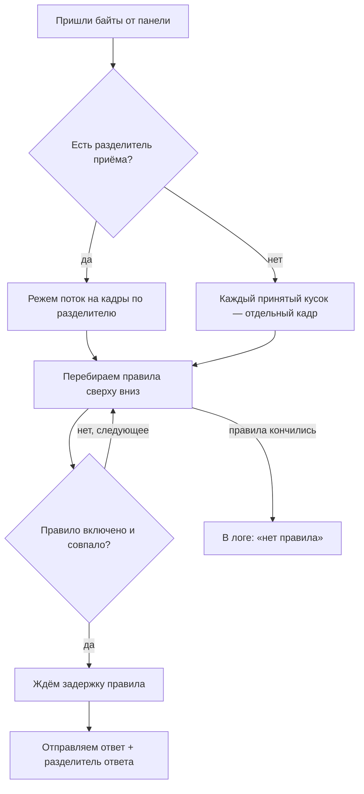
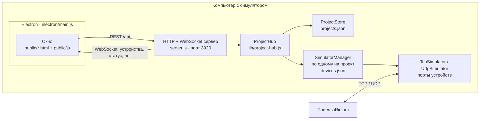
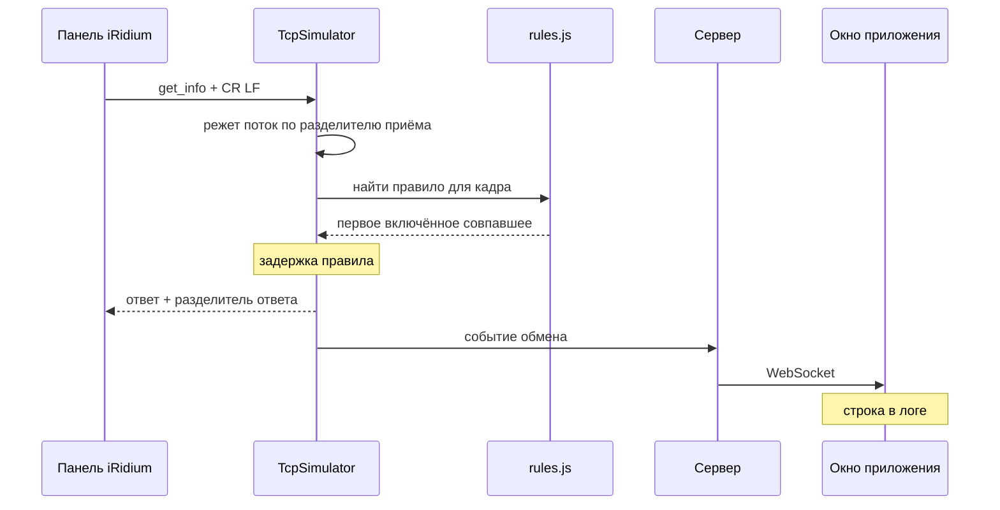

# Device Simulator — симулятор TCP/UDP устройств

Настольное приложение для отладки проектов **iRidium (iRidi)** без реального оборудования. Оно изображает матрицы, проекторы, телевизоры, панели — любое устройство, которым управляют текстовыми или hex-командами по TCP или UDP: принимает команды от панели, отвечает по заданным правилам и показывает весь обмен в логе.

Типичный сценарий: оборудования ещё нет на объекте или до него не дотянуться, а интерфейс в iRidium уже надо собрать и проверить обратную связь. Заводишь в симуляторе нужные устройства, описываешь, что каждое отвечает на какую команду, — и панель работает с ними как с настоящими.

Работает как приложение для Windows (Electron) или как обычный веб-сервер, открываемый в браузере. Полностью офлайн.

---

## Содержание

- [Возможности](#возможности)
- [Быстрый старт](#быстрый-старт)
- [Как пользоваться](#как-пользоваться)
- [Сборка exe](#сборка-exe)
- [Где хранятся данные](#где-хранятся-данные)
- [Как устроено](#как-устроено)
- [Структура проекта](#структура-проекта)
- [HTTP API](#http-api)
- [Для разработчика](#для-разработчика)
- [Частые вопросы](#частые-вопросы)

---

## Возможности

**Проекты**
- У каждого проекта свой адрес (`/p/<адрес>`) и свой набор устройств — удобно держать отдельно объекты или стенды.
- Вкладки «Текущие» и «Архив»: законченные проекты убираются в архив и не мешают в списке.
- Поиск по имени в открытой вкладке.
- Даты создания и последнего изменения. Дата изменения двигается от правки устройств и правил, но не от запуска и остановки.
- Экспорт и импорт в JSON: всех проектов, выбранных или одного из карточки.

**Устройства**
- TCP (сервер, к которому подключается панель) или UDP.
- Текстовый или hex-режим.
- Разделители приёма и ответа: `\r`, `\n`, `\xFF`, `hex:FF` и любые их сочетания.
- Перетаскивание для порядка, копирование, экспорт и импорт устройств между проектами.
- «Запустить все» / «Остановить все».

**Правила ответа**
- Режимы совпадения: «точно», «начинается с», «содержит».
- Задержка ответа в миллисекундах.
- Каждое правило включается и выключается отдельно.
- На запущенном устройстве можно править команды и ответы на ходу — без перезапуска.

**Команды**
- Заготовленные посылки, которые отправляются подключённому клиенту по кнопке — чтобы проверить, как панель реагирует на сообщения от устройства.

**Лог обмена**
- Направление каждой строки (RX/TX), какое правило сработало или что правила не нашлось.
- Режим RAW: сырые принятые байты и буфер приёма.
- До 5000 записей на устройство. На экране — последние, остальное подгружается прокруткой вверх. Если отмотал назад, лог стоит на месте, а внизу появляется кнопка «↓ N новых».

**Прочее**
- Справочник «Адреса компьютера»: все IPv4-адреса с именами интерфейсов, виртуальные (VPN, Hyper-V, WSL) помечены. Адрес, по которому к симулятору уже реально подключались, отмечается как проверенный. Щелчок копирует.
- Темы: тёмная, светлая и VS Code (Dark+). Шрифт интерфейса на выбор.
- Только системные шрифты и никаких внешних запросов — работает без интернета.

---

## Быстрый старт

### Готовая сборка

Если в [Releases](../../releases) выложена сборка — скачай `DeviceSimulator-<версия>.exe` и запусти. Установка не нужна, это переносимый exe. Если нет — собери сам, см. [«Сборка exe»](#сборка-exe).

### Из исходников

Нужен [Node.js](https://nodejs.org/) 18 или новее.

```powershell
git clone https://github.com/vesloguzov/device-simulator.git
cd device-simulator
npm install
```

Запустить как приложение (окно Electron):

```powershell
npm run electron
```

Или только сервер — и открыть в браузере `http://127.0.0.1:3920/projects`:

```powershell
npm start
```

Порт интерфейса по умолчанию — **3920**. Сменить можно переменной окружения `PORT`:

```powershell
$env:PORT = 4000; npm start
```

### Попробовать на примере

В папке [`test_data`](test_data) лежит готовый проект [`example-room.json`](test_data/example-room.json) — аудитория с семью устройствами:

| Устройство | Протокол | Порт |
|---|---|---|
| Матрица Prestel FM 8×8 | TCP, текст | 8008 |
| Телевизоры Basic G3 ×3 | TCP, текст | 8009–8011 |
| ТВ в стойке 02CL | TCP, hex | 8012 |
| DSP CVG | UDP, текст | 50000 |
| Камера VISCA | UDP, hex | 1259 |

Импорт: **Проекты → Импорт → `test_data/example-room.json` → Продолжить**. Появится проект «Пример аудитории» — открой его, запусти устройства и подключай панель на эти порты.

У некоторых устройств на один запрос заведено несколько правил — например, «питание? (включено)» и «питание? (выключено)» у телевизоров или три варианта источника у ТВ в стойке. Срабатывает верхнее включённое, поэтому так и изображают состояние устройства: чтобы телевизор «выключился», сними галочку «Вкл» у правила «включено» или перетащи «выключено» выше.

---

## Как пользоваться

1. **Создай проект** на странице «Проекты». Адрес назначается сам по имени (кириллица переводится в латиницу) или задаётся вручную.
2. **Добавь устройство** кнопкой «+»: имя, порт, протокол, кодировка, разделители.
3. **Опиши правила ответа**: какая команда приходит и что на неё отвечать.
4. **Запусти устройство.**
5. **В iRidium укажи IP компьютера с симулятором и порт устройства.** IP удобно взять в блоке «Адреса компьютера» на странице проектов.

### Адрес привязки

По умолчанию устройство слушает на `0.0.0.0` — то есть на всех сетевых интерфейсах компьютера. Так и стоит оставить. Если вписать конкретный IP, устройство перестанет запускаться, как только компьютер получит другой адрес, например при смене сети или по DHCP.

### Как срабатывают правила



- Срабатывает **первое** подходящее правило, поэтому порядок важен: частные случаи ставь выше общих.
- Разделитель ответа дописывается, только если ответ ещё не заканчивается на него.
- В текстовых ответах работают последовательности `\r`, `\n`, `\t`, `\0` и `\xHH` — они превращаются в настоящие байты.
- В hex-режиме и команда, и ответ пишутся шестнадцатеричными байтами; пробелы между ними можно ставить, можно не ставить: `A0 01 FF` и `A001FF` — одно и то же.

### Разделители

| Запись | Что это |
|---|---|
| `\r\n` | перевод строки Windows (CR LF) |
| `\r` | только CR |
| `\xFF` | один байт с кодом FF |
| `hex:DD EE FF` | несколько байтов в hex |
| пусто | для приёма — кадр целиком, как пришёл; для ответа — ничего не дописывать |

### UDP

Устройство отвечает тому, кто прислал запрос. Команды по кнопке уходят последнему клиенту, от которого что-то приходило.

---

## Сборка exe

```powershell
npm run dist:win
```

Результат — переносимый `dist\DeviceSimulator-<версия>.exe`. Версия берётся из `package.json`.

Сборку делает [electron-builder](https://www.electron.build/). После упаковки скрипт [`build/after-pack.js`](build/after-pack.js) удаляет из сборки лишнее от Chromium: языковые файлы интерфейса, кроме английского и русского, и компилятор шейдеров DirectX, который не нужен приложению без 3D. Это экономит около 67 МБ.

**Если сборка «зависла»** на строке `packaging`:
- Скорее всего, вывод придержал терминал: в обычном окне консоли Windows щелчок мышью внутри окна ставит вывод на паузу. Нажми **Esc** или **Enter** в этом окне.
- Проверить, так ли это, можно, отправив вывод в файл, — тогда терминал в сборке не участвует:
  ```powershell
  npm run dist:win *> build.log
  ```
- Если и так встаёт — вероятно, антивирус проверяет только что распакованный `electron.exe`. Подробный лог покажет точный шаг:
  ```powershell
  $env:DEBUG = 'electron-builder'; npm run dist:win *> build-debug.log; Remove-Item Env:\DEBUG
  ```

---

## Где хранятся данные

| Запуск | Папка данных |
|---|---|
| exe / `npm run electron` | `%APPDATA%\device-simulator\data` |
| `npm start` | `data\` в папке проекта |

```
data/
├── projects.json            список проектов: имя, адрес, описание, даты, признак архива
└── projects/
    └── <id проекта>/
        └── devices.json     устройства проекта с правилами и командами
```

Всё хранится в обычных JSON-файлах — их можно читать, сравнивать и бэкапить.

Отдельно лежат:
- **`%APPDATA%\device-simulator\shell.json`** — настройки окна: системная или своя шапка, её цвета;
- **настройки интерфейса** (тема, шрифт, миллисекунды в логе) и раскладка панелей — в хранилище браузера внутри приложения.

Старые файлы данных читаются без миграций: недостающие поля (даты, признак архива) заполняются при загрузке.

---

## Как устроено

### Компоненты



- **Electron** при запуске поднимает сервер внутри себя и открывает окно с его страницами. Без Electron тот же сервер запускается обычным `node server.js`, а страницы открываются в браузере.
- **Сервер** отдаёт интерфейс, REST API и WebSocket. Через WebSocket окно получает обновления устройств и строки лога — сразу, без опроса.
- **ProjectHub** знает все проекты и для каждого держит свой **SimulatorManager**, который хранит устройства, запускает и останавливает их.
- **TcpSimulator / UdpSimulator** — сами имитаторы: слушают порт, режут поток на кадры, ищут правило в [`lib/rules.js`](lib/rules.js) и отвечают.

### Путь одной команды



### Интерфейс

Страницы собраны без сборщика: нативные ES-модули из [`public/js`](public/js), которые браузер грузит как есть. Electron 37 их поддерживает, поэтому в exe попадает ровно то, что лежит в `public/`.

Рабочий экран проекта перерисовывает только то, что изменилось. Карточка правила строится один раз и при обновлениях с сервера меняет лишь значения полей — поэтому пакет по WebSocket не сбивает фокус и каретку, пока ты печатаешь.

---

## Структура проекта

```
device-simulator/
├── electron/
│   ├── main.js              окно, шапка, тема окна, запуск встроенного сервера
│   ├── preload.js           мост окна и Electron: диалоги, цвета шапки
│   └── free-port.js         освобождение порта интерфейса при старте
├── lib/
│   ├── project-hub.js       проекты и их менеджеры, экспорт и импорт, архив
│   ├── project-store.js     projects.json: проекты, адреса, даты
│   ├── simulator-manager.js устройства проекта: хранение, запуск, правка на ходу
│   ├── tcp-sim.js           TCP-имитатор
│   ├── udp-sim.js           UDP-имитатор
│   ├── rules.js             разбор разделителей, поиск правила, сборка ответа
│   └── net-info.js          адреса компьютера и отметка проверенных
├── public/
│   ├── index.html           рабочий экран проекта
│   ├── projects.html        список проектов
│   ├── settings.html        настройки
│   ├── styles.css           все стили и темы
│   ├── js/                  модули интерфейса
│   └── vendor/              SortableJS — перетаскивание
├── build/
│   ├── after-pack.js        чистка сборки
│   └── icon.ico, icon.png   иконка приложения
├── server.js                HTTP + WebSocket сервер, точка входа npm start
└── package.json             зависимости, скрипты, настройки electron-builder
```

---

## HTTP API

Сервер слушает `http://127.0.0.1:3920` (и все интерфейсы компьютера). Тела запросов и ответов — JSON.

**Проекты**

| Метод | Путь | Что делает |
|---|---|---|
| `GET` | `/api/projects` | список проектов со статистикой |
| `POST` | `/api/projects` | создать: `{ name, slug?, description? }` |
| `PUT` | `/api/projects/:id` | переименовать: `{ name?, description? }` |
| `DELETE` | `/api/projects/:id` | удалить вместе с устройствами |
| `POST` | `/api/projects/:id/archive` | в архив `{ archived: true }` или обратно `{ archived: false }` |
| `GET` | `/api/projects/by-slug/:slug` | проект по адресу |
| `POST` | `/api/projects/export` | выгрузка: `{ ids: [...] }` |
| `POST` | `/api/projects/import` | загрузка: `{ projects: [...] }` |

**Устройства проекта**

| Метод | Путь | Что делает |
|---|---|---|
| `GET` | `/api/p/:slug/devices` | устройства с состоянием |
| `POST` | `/api/p/:slug/devices` | создать устройство |
| `PUT` | `/api/p/:slug/devices/:id` | изменить; на работающем — только правила и команды |
| `DELETE` | `/api/p/:slug/devices/:id` | удалить |
| `POST` | `/api/p/:slug/devices/:id/start` | запустить |
| `POST` | `/api/p/:slug/devices/:id/stop` | остановить |
| `POST` | `/api/p/:slug/devices/start-all` | запустить все |
| `POST` | `/api/p/:slug/devices/stop-all` | остановить все |
| `POST` | `/api/p/:slug/devices/:id/send` | отправить клиенту: `{ body, note? }` |
| `POST` | `/api/p/:slug/devices/reorder` | порядок: `{ ids: [...] }` |

**Прочее**

| Метод | Путь | Что делает |
|---|---|---|
| `GET` | `/api/network` | адреса компьютера с отметкой виртуальных и проверенных |
| `WS` | `/ws?project=<slug>` | поток обновлений проекта: `devices`, `status`, `traffic` |

---

## Для разработчика

- **Без сборщика.** Код интерфейса правится и сразу работает. Удобнее всего вести разработку через `npm start` в браузере: правка в `public/` — обнови страницу (`F5`). В окне Electron перезагрузки по клавише нет — у приложения своё меню только с пунктами правки, — так что там нужен перезапуск. Изменения в `lib/`, `server.js` и `electron/` в любом случае требуют перезапуска.
- **Стиль.** Все цвета — токены в начале [`styles.css`](public/styles.css). Новая тема: блок `[data-theme='<id>']` с теми же токенами и строка в `THEMES` в [`public/js/app-settings.js`](public/js/app-settings.js) — цвета шапки окна подхватятся сами. Новые сочетания цветов стоит проверять на контраст: текстовые ярусы держат 4.5:1 на своих подложках.
- **Шрифты** только системные: приложение работает офлайн, веб-шрифты не подключаются. Новый вариант — блок `[data-font='<id>']` и строка в `FONTS`.
- **Электрон-окно** загружает страницы с локального сервера, поэтому всё, что работает в браузере через `npm start`, работает и в exe.

---

## Частые вопросы

**Панель не подключается к устройству.**
Проверь, что устройство запущено (зелёная лампа в списке), порт совпадает и в iRidium указан адрес именно того компьютера, а не VPN-адаптера — блок «Адреса компьютера» помечает виртуальные. При первом запуске Windows может спросить разрешение для сети: без него подключения извне не пройдут.

**Порт устройства занят.**
Задать двум устройствам одного протокола один и тот же порт можно, а вот запустить их одновременно — нет: второе не стартует, и приложение скажет, каким устройством порт уже занят. То же, если порт держит другая программа, — запуск не пройдёт, и в сообщении будет причина.

**Порт интерфейса 3920 занят.**
При старте приложение освобождает порт 3920 — **процесс, который его занимает, будет завершён**. Если на этом порту работает что-то нужное, запусти симулятор на другом порту через переменную `PORT`.

**Куда делась тема или шрифт?**
Настройки интерфейса хранятся отдельно от данных проектов — в хранилище браузера внутри приложения. Перенос папки `data` их не переносит.
